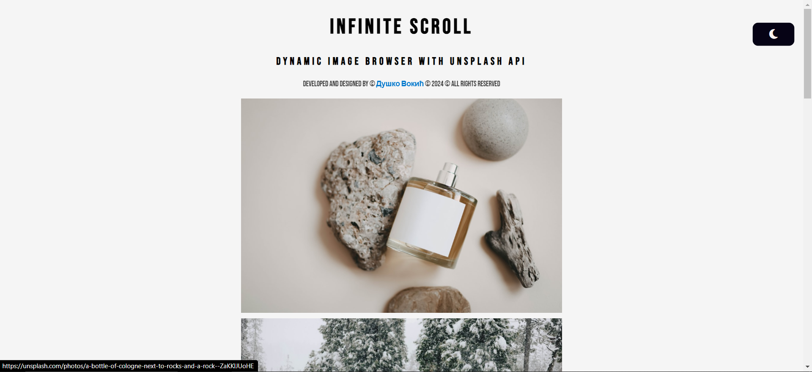

# Infinite Scroll - Dynamic Image Browser: Embracing Functional Programming with Unsplash API

You can check it out [here](https://d-vokic.github.io/Infinite-Scroll-with-Unsplash-Api/).

## Author

👤 **Duško Vokić**

* LinkedIn: [Here](https://linkedin.com/in/duško-vokić-0337a2106)
* GitHub: [@D-vokic](https://github.com/D-vokic)

This JavaScript application utilizes functional programming principles to dynamically fetch and display random images from the Unsplash API, offering users a seamless and interactive browsing experience.

## Usage Instructions

1. Initial Load:
>> Upon opening the application, a selection of random images will be displayed for immediate viewing.
2. Scroll for More:
>> Scroll down the page to automatically load additional images from the Unsplash API.
3. Dark Mode Toggle:
>> Click on the dark mode button to switch between light and dark themes for personalized viewing preferences.
4. Back to Top:
>> To quickly return to the top of the page, click on the "Back to Top" button conveniently located at the bottom right corner.
5. Interactivity:
>> Enjoy a smooth and interactive browsing experience with event-driven functionalities, such as dynamic image loading and responsive theme toggling.
6. Error Handling:
>> In case of network issues or API failures, informative alerts will guide users, ensuring a reliable browsing experience.
2. Enjoy beautiful animations, mixins and interesting solutions.

Explore, interact, and enjoy the curated collection of images seamlessly presented through the power of functional programming and the Unsplash API.

## Additional: Asynchronous Data Fetching in More Detail:

### Overview
Experience uninterrupted browsing with our application's asynchronous data fetching feature. Leveraging modern JavaScript techniques, our application seamlessly retrieves additional images from the Unsplash API as you scroll, ensuring a continuous flow of captivating visuals without any disruptions. This innovative approach enhances performance, responsiveness, and user engagement, allowing you to explore an ever-expanding collection of high-quality images effortlessly. Enjoy a fluid and dynamic browsing experience, where each scroll unveils new possibilities and inspiration.

### Key Features

1. Seamless Loading: Enjoy a seamless browsing experience as images load dynamically in the background while you scroll through the page.

2. Efficiency: Asynchronous fetching optimizes performance by fetching data independently of other operations, ensuring smooth user interaction and responsiveness.

3. Continuous Exploration: Explore a vast array of images without interruption, as the application intelligently fetches additional content as needed, enhancing the depth of your browsing experience.

4. Enhanced Responsiveness: By leveraging asynchronous techniques, the application remains responsive to user interactions, allowing for fluid navigation and exploration of the image gallery.

5. Adaptive Loading: Asynchronous data fetching adapts to varying network conditions, ensuring that users can seamlessly access content regardless of their internet connection speed.

6. Effortless Scalability: The application's architecture allows for effortless scalability, accommodating future enhancements and expansions to the image collection without sacrificing performance or user experience.

### Usage

1. Toggle Button: A prominent toggle button located within the application interface allows users to switch between Dark and Light modes effortlessly.
2. Persistent Setting: The selected mode preference is often saved across sessions, ensuring that users enjoy their preferred mode each time they access the application.

### Implementation
1. Fetch Function:
>> Utilize the fetch API to asynchronously retrieve data from the Unsplash API endpoint, ensuring non-blocking execution and optimal performance.
2. Async/Await Syntax:
>> Employ the async and await keywords to handle asynchronous operations elegantly, simplifying code readability and maintenance.
3. Dynamic Loading:
>> Implement dynamic loading logic within event listeners, such as the scroll event, to trigger additional data fetching when users reach predefined thresholds, ensuring a seamless browsing experience.
4. Error Handling:
>> Incorporate robust error handling mechanisms using try/catch blocks to gracefully manage potential network errors or API failures, providing users with informative feedback and maintaining application reliability.
5. Promise Chaining:
>> Leverage promise chaining techniques to execute sequential asynchronous operations, ensuring proper data flow and avoiding callback hell, thereby enhancing code organization and maintainability.
6. Optimized Performance:
>> Optimize data fetching strategies by specifying appropriate API parameters, such as image count and query parameters, to minimize unnecessary network requests and reduce load times, resulting in improved application performance and user satisfaction.

### Integration
Our application seamlessly integrates asynchronous data fetching capabilities to enhance user experience and performance. Leveraging JavaScript's asynchronous programming paradigm, we utilize the Fetch API to communicate with the Unsplash API asynchronously. As users scroll through the page, our application dynamically retrieves additional images in the background, ensuring a smooth and uninterrupted browsing experience. 

### Conclusion
Asynchronous data fetching revolutionizes the browsing experience by seamlessly retrieving content in the background, enabling users to enjoy a fluid and uninterrupted exploration of dynamic content. By leveraging this powerful technique, our application ensures optimal performance, responsiveness, and user engagement, setting the stage for a truly immersive browsing experience.

## Technologies and Languages

- HTML5
- CSS3 (Sass)
- JavaScript
- AOS

## License

This project is licensed under the [MIT License](https://www.mit.edu/~amini/LICENSE.md).

## Contact Information

You can contact me via email: vokic.dusko@gmail.com
